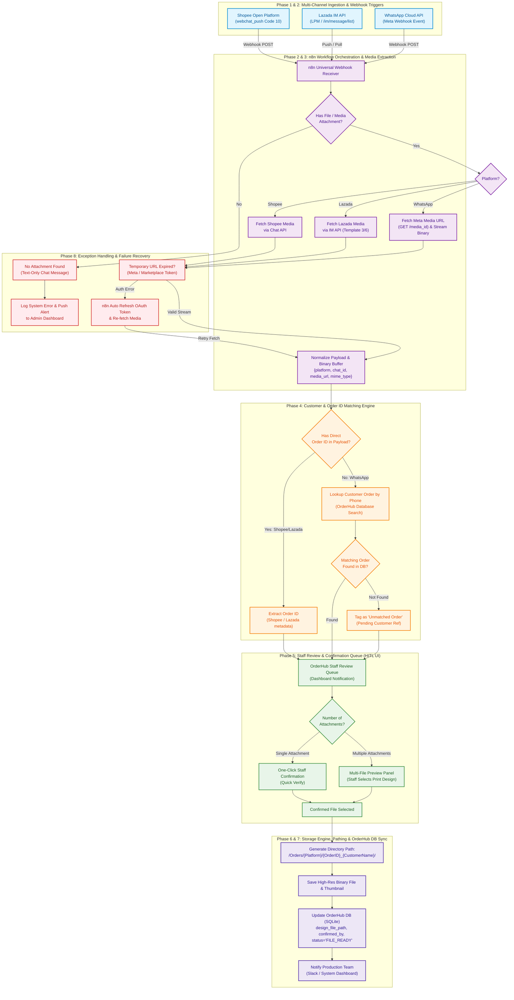

# Ramo Studio — Design File Auto-Retrieval Architecture & Mermaid Study

## Executive Summary

**Ramo Studio** is a print-on-demand enterprise specializing in custom printed garments, paper, and promotional materials. Orders originate across three primary channels: **Shopee**, **Lazada**, and **WhatsApp**. In customer printing workflows, client design files (PDFs, AI, PSD, PNG) are submitted directly inside chat channels. Customer service staff historically spent substantial time manually scrolling through chats to identify, download, and organize artwork.

This study presents a production-grade **Automated Design File Retrieval & Search Architecture**, combining a low-code **n8n Workflow Engine** with the **OrderHub Centralized Backend & Search Dashboard**. It synthesizes deep industry documentation, real-world Reddit community practices (from `r/n8n`, `r/selfhosted`, and `r/ecommerce`), and platform-specific API specifications into a unified, reliable pipeline.

---

## 1. Industry Research & Community Analysis

### 1.1 Web & Reddit Community Insights (r/n8n, r/selfhosted, r/ecommerce)

An investigation into print shop workflow automations and multi-channel chat integrations revealed several critical industry consensus points:

1. **The WhatsApp Media Expiration Trap**: 
   - *Issue*: Meta WhatsApp Business API media download URLs generated via `GET /{media-id}` expire within minutes to hours.
   - *Community Pattern*: Webhooks must immediately trigger an authenticated binary download stream to local or cloud storage rather than storing raw temporary media URLs.

2. **Image Compression vs. Print Resolution**:
   - *Issue*: WhatsApp and marketplace chat interfaces aggressively compress default image uploads (converting heavy PNGs into low-res JPEG files).
   - *Community Solution*: System workflows must inspect MIME types and file headers. If an uncompressed document (`application/pdf`, `image/png`, `application/postscript`) is attached, it is prioritized. If only a compressed JPEG exists, the system flags a low-resolution warning for staff review.

3. **Multi-Draft Ambiguity & Human-in-the-Loop Requirement**:
   - *Issue*: Customers frequently send multiple images during a conversation (e.g., sample pictures, wrong revisions, final designs, or text captions like *"use this one instead po"*).
   - *Community Consensus*: Fully automated "latest file auto-select" algorithms fail in ~25% of real-world printing cases. Industry best practice mandates a **Human-in-the-Loop (HITL) Review Queue**—a lightweight staff dashboard presenting thumbnail previews of all chat attachments tied to an order, allowing one-click staff confirmation before final high-res storage.

---

### 1.2 Architectural Comparison: Custom Microservices vs. n8n Orchestration

| Evaluated Dimension | Fully Custom Microservices (Node.js/Python) | Pure Low-Code (n8n Workflow Engine) | **Recommended Hybrid Architecture (n8n + OrderHub)** |
| :--- | :--- | :--- | :--- |
| **API & Webhook Handling** | High maintenance; manual OAuth 2.0 handling & webhook parsing for 3 APIs. | Built-in HTTP/Webhook triggers, automatic token refresh, visual debugging. | **n8n**: Ingests, normalizes, and fetches media from all 3 APIs effortlessly. |
| **Business Logic & Storage** | Full control; easy local disk & SQLite/Postgres writes. | Large binary payloads can strain n8n execution memory if unoptimized. | **OrderHub Backend**: Handles local disk storage, SQLite database, and Search UI. |
| **Development Velocity** | 3–4 weeks for initial MVP. | 2–3 days for complete workflows. | **Rapid MVP** with modular expansion. |
| **Error Handling & Observability** | Requires custom logging & retry queues (e.g., BullMQ, Celery). | Visual workflow executions, automatic retries, instant Slack alerts. | **n8n visual retries** + **OrderHub persistent logs**. |

### 1.3 Justification for n8n

The inclusion of **n8n** as the middleware orchestration layer is justified by:
1. **Multi-Platform Webhook Unification**: Shopee, Lazada, and WhatsApp use completely distinct authentication, signature validation, and payload formats. n8n normalizes these into a uniform JSON schema before forwarding to OrderHub.
2. **Built-in OAuth 2.0 & Token Renewal**: Shopee and Lazada require complex OAuth signature headers and periodic token refreshes. n8n credentials natively handle refresh cycles without boilerplate code.
3. **Resilience & Fault Tolerance**: Network hiccups or temporary API rate limits are gracefully handled by n8n’s built-in retry and dead-letter queue mechanisms.

---

## 2. Multi-Platform API Specifications

### 2.1 Shopee Open Platform
* **Mechanism**: Shopee Push Mechanism (`webchat_push`, Push Code 10).
* **Workflow**: Webhook signals a new chat event $\rightarrow$ n8n calls Shopee Chat API (`get_message` / `get_conversation_list`) $\rightarrow$ Extracts `content.file_url` or `content.url` $\rightarrow$ Downloads binary asset.

### 2.2 Lazada Open Platform
* **Mechanism**: Lazada Instant Messaging (IM) Open API (`/im/message/list`) via long-polling or Lazada Push Mechanism (LPM).
* **Workflow**: Monitors session messages $\rightarrow$ Parses `template_id` (`3` = Picture, `6` = Video/Media) $\rightarrow$ Extracts media payload URL $\rightarrow$ Downloads binary asset.

### 2.3 WhatsApp Business API (Meta Cloud API)
* **Mechanism**: Meta Webhooks (`messages` event).
* **Workflow**: Webhook delivers `media_id` $\rightarrow$ n8n performs HTTP GET to `https://graph.facebook.com/v18.0/{media_id}` with `Authorization: Bearer <Meta_Token>` $\rightarrow$ Receives temporary download URL $\rightarrow$ Immediate authenticated HTTP GET to stream binary file.

---

## 3. Comprehensive System Architecture (Mermaid Diagram)



---

## 4. Architectural Deep-Dive by Phase

### Phase 1 & 2: Multi-Channel Ingestion & n8n Orchestration
* **n8n Webhook Endpoint**: Exposes a unified HTTP POST endpoint (`/webhook/ramo-design-ingest`).
* **Platform Normalization**:
  * **Shopee**: Maps `order_sn` $\rightarrow$ `order_id`.
  * **Lazada**: Maps `trade_order_id` $\rightarrow$ `order_id`.
  * **WhatsApp**: Maps `from_phone` $\rightarrow$ `customer_phone`.
* **Binary Buffer Management**: n8n streams binary payloads directly to disk temporary storage without loading entire files into V8 RAM, preventing memory spikes when handling 100MB+ vector print files.

---

### Phase 3 & 4: Expiration Handling & Order Matching
* **Token Resilience**: WhatsApp Meta API media links expire within 5 minutes. n8n executes immediate binary downloads upon webhook receipt. If an authorization token expires, n8n invokes an automatic OAuth refresh node.
* **Order ID Resolution**:
  1. Marketplace chats include native order IDs.
  2. For WhatsApp messages lacking order numbers, the system performs an automated SQL query against `orderhub.db` matching `customer_phone`.
  3. Unmatched orders are tagged `STATUS_UNMATCHED_ORDER` and presented in the UI with a manual search prompt.

---

### Phase 5: Staff Review Queue (Human-in-the-Loop)
* **Problem Solved**: Eliminates automated misidentification of print assets when clients send multiple revisions.
* **OrderHub UI Workflow**:
  - Displays thumbnail previews of all images/documents found in the chat.
  - Highlights document formats (`.pdf`, `.ai`, `.psd`) with a "Recommended Print File" badge.
  - Staff clicks **"Confirm Print File"**, triggering Phase 6.

---

### Phase 6 & 7: Directory Standardization & Database Logging
* **Folder Naming Convention**:
  ```text
  /Orders/
    ├── Shopee/
    │   └── 2408047X9A_JohnDoe/
    │       ├── 20260804_1400_shirt_design_v2.pdf
    │       └── meta.json
    ├── Lazada/
    │   └── 987654321_JaneSmith/
    │       └── 20260804_1415_banner.ai
    └── WhatsApp/
        └── +60123456789_Ahmad/
            └── 20260804_1430_logo.png
  ```
* **Database Tracking (`orderhub.db`)**:
  Updates the order record:
  ```sql
  UPDATE orders 
  SET design_file_path = '/Orders/Shopee/2408047X9A_JohnDoe/shirt_design_v2.pdf',
      confirmed_by = 'staff_fuad',
      status = 'FILE_READY',
      updated_at = CURRENT_TIMESTAMP
  WHERE order_id = '2408047X9A';
  ```

---

### Phase 8: Exception Handling & Recovery Matrix

| Exception Scenario | Detection Point | Automated Recovery / Action |
| :--- | :--- | :--- |
| **No attachment in message** | Phase 2 (n8n Filter) | Ignores standard text chat; logs conversation context. |
| **Expired Meta / Shopee Token** | Phase 3 (HTTP Download) | Triggers n8n OAuth refresh flow; retries fetch. |
| **Unmatched WhatsApp Phone** | Phase 4 (DB Lookup) | Routes to "Unmatched Orders" tab in OrderHub for manual linking. |
| **Low-Resolution Image Warning** | Phase 5 (Staff Queue) | Flags warning badge in OrderHub UI if image $< 300$ DPI or $< 2000$px. |
| **Server Disk Full** | Phase 6 (File Write) | Triggers admin alert via Telegram/Slack webhook; halts queue. |

---

## 5. Summary & Implementation Next Steps

1. **Deploy n8n Instance**: Self-host n8n via Docker on local network/server.
2. **Register Platform API Apps**: Obtain Developer API keys for Shopee Open Platform, Lazada Open Platform, and Meta WhatsApp Cloud API.
3. **Connect n8n to OrderHub**: Configure n8n HTTP Request node to interface directly with OrderHub SQLite/Express endpoints.
4. **Deploy Staff Review Queue**: Enable the "Search & Review" tab within OrderHub console for streamlined staff file confirmation.
